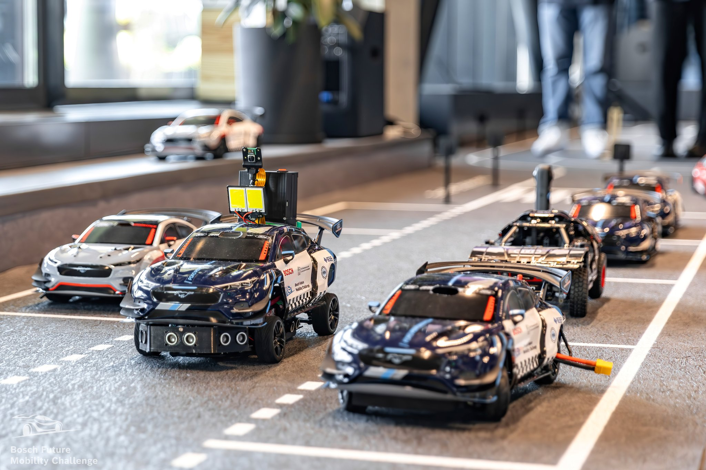

# Welcome to Tomiio's Blog

Hello and thanks for visiting my blog! Here, I share my experiences, projects, and insights on topics like embedded systems, robotics, programming, and more. Whether you're a fellow developer, hobbyist, or just curious, I hope you'll find something interesting and useful.

This blog is my way of sharing stories from my journey—documenting the challenges, discoveries, and lessons learned through my projects.

Check out my projects at:  
- [11/2022 - Autonomous Driving Vehicle](autonomous-car.md).  
- [07/2023 - BLDC Driver (FOC - Field Oriented Control)](bldc-driver.md).  
- [10/2023 - Handsignator (Deaf-mute disablities support device)](handsignator.md).  
- [10/2025 - Autonomous Wheelchair](autonomous-wheelchair.md)